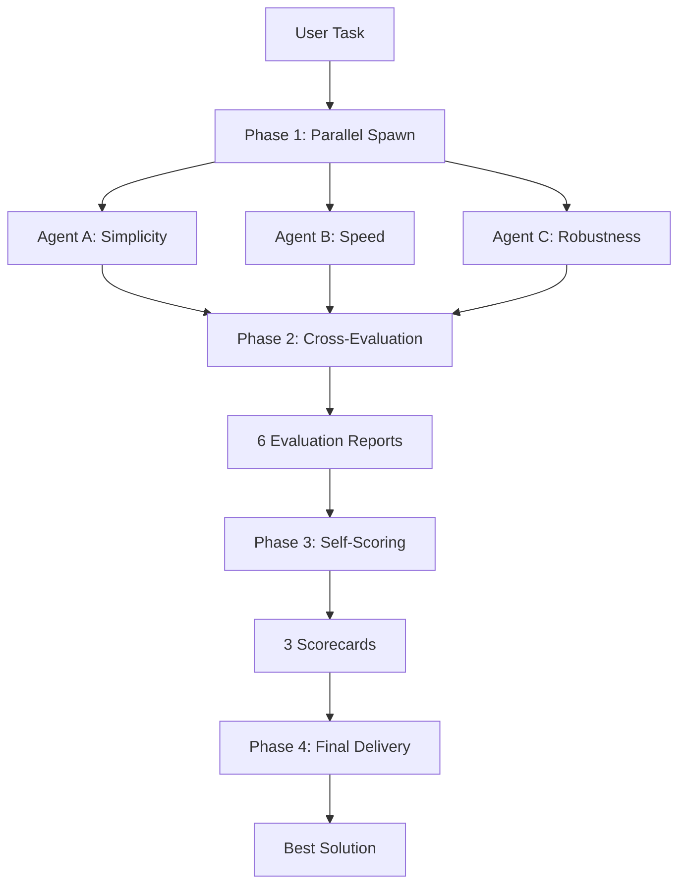

# b3ehive Skill Specification
## PCTF-Compliant Multi-Agent Competition System

---

## 1. Purpose (PCTF: Purpose)

Enable competitive code generation where three isolated AI agents implement the same functionality, evaluate each other objectively, and deliver the optimal solution through data-driven selection.

---

## 2. Task Definition (PCTF: Task)

### Input
- **task_description**: String describing the coding task
- **constraints**: Optional constraints (time/space complexity, language, etc.)

### Output
- **final_solution**: Directory containing the winning implementation
- **comparison_report**: Markdown analysis of all three approaches
- **decision_rationale**: Explanation of why the winner was selected

### Success Criteria
```yaml
assertions:
  - final_solution/implementation exists and is runnable
  - comparison_report.md exists with objective metrics
  - decision_rationale.md explains selection logic
  - all three agent implementations are documented
  - evaluation scores are numeric and justified
```

---

## 3. Chain Flow (PCTF: Chain)



### Phase 1: Parallel Implementation
**Agent Prompt Template**:
```yaml
role: "Expert Software Engineer"
focus: "{{agent_focus}}"  # Simplicity / Speed / Robustness
task: "{{task_description}}"
constraints:
  - Complete runnable code in implementation/
  - Checklist.md with ALL items checked
  - SUMMARY.md with competitive advantages
  - Must differ from other agents' approaches

linter_rules:
  - code_compiles: true
  - tests_pass: true
  - no_todos: true
  - documented: true

assertions:
  - implementation/main.* exists
  - tests exist and pass
  - Checklist.md is complete
  - SUMMARY.md explains unique approach
```

### Phase 2: Cross-Evaluation
**Evaluation Prompt Template**:
```yaml
evaluator: "Agent {{from}}"
target: "Agent {{to}}"
task: "Objectively prove your solution is superior"

dimensions:
  simplicity:
    weight: 20
    metrics:
      - lines_of_code: count
      - cyclomatic_complexity: calculate
      - readability_score: 1-10
  
  speed:
    weight: 25
    metrics:
      - time_complexity: big_o
      - space_complexity: big_o
      - benchmark_results: run_if_possible
  
  stability:
    weight: 25
    metrics:
      - error_handling_coverage: percentage
      - resource_cleanup: check
      - fault_tolerance: test
  
  corner_cases:
    weight: 20
    metrics:
      - input_validation: comprehensive
      - boundary_conditions: covered
      - edge_cases: tested
  
  maintainability:
    weight: 10
    metrics:
      - documentation_quality: 1-10
      - code_structure: logical
      - extensibility: easy/hard

assertions:
  - evaluation is objective with data
  - specific code snippets cited
  - numeric scores provided
  - persuasion argument is data-driven
```

### Phase 3: Objective Scoring
**Scoring Prompt Template**:
```yaml
agent: "Agent {{name}}"
task: "Fairly score yourself and competitors"

self_evaluation:
  - dimension: simplicity
    max: 20
    score: "{{self_score}}"
    justification: "{{why}}"
  
  - dimension: speed
    max: 25
    score: "{{self_score}}"
    justification: "{{why}}"
  
  - dimension: stability
    max: 25
    score: "{{self_score}}"
    justification: "{{why}}"
  
  - dimension: corner_cases
    max: 20
    score: "{{self_score}}"
    justification: "{{why}}"
  
  - dimension: maintainability
    max: 10
    score: "{{self_score}}"
    justification: "{{why}}"

peer_evaluation:
  - target: "Agent {{other}}"
    scores: "{{numeric_scores}}"
    comparison: "{{objective_comparison}}"

final_conclusion:
  best_implementation: "[A/B/C/Mixed]"
  reasoning: "{{data_driven_justification}}"
  recommendation: "{{delivery_strategy}}"

assertions:
  - all scores are numeric
  - justifications are specific
  - no inflation or bias
  - conclusion is evidence-based
```

### Phase 4: Final Delivery
**Decision Logic**:
```python
def select_winner(scores):
    """
    Select final solution based on competitive scores
    """
    margins = calculate_score_margins(scores)
    
    if margins.winner - margins.second > 15:
        # Clear winner
        return SingleWinner(scores.winner)
    elif margins.winner - margins.second > 5:
        # Close competition, consider hybrid
        return HybridSolution(scores.top_two)
    else:
        # Very close, pick simplest
        return SimplestImplementation(scores.all)

assertions:
  - final_solution is runnable
  - comparison_report explains all approaches
  - decision_rationale is transparent
  - attribution is given to winning agent
```

---

## 4. Format Specifications (PCTF: Format)

### Directory Structure
```
workspace/
├── run_a/
│   ├── implementation/      # Agent A code
│   ├── Checklist.md         # Completion checklist
│   ├── SUMMARY.md           # Approach summary
│   ├── evaluation/          # Evaluations of B, C
│   └── SCORECARD.md         # Self-scoring
├── run_b/                   # Same structure
├── run_c/                   # Same structure
├── final/                   # Winning solution
├── COMPARISON_REPORT.md     # Full analysis
└── DECISION_RATIONALE.md    # Why winner selected
```

### File Formats
- **Checklist.md**: Markdown with `- [x]` checkboxes
- **SUMMARY.md**: Markdown with sections
- **EVALUATION_*.md**: Markdown with tables
- **SCORECARD.md**: Markdown with score tables
- **Implementation**: Runnable code files

---

## 5. Linter & Validation

### Pre-commit Checks
```bash
#!/bin/bash
# scripts/lint.sh

lint_agent_output() {
    local agent_dir="$1"
    local errors=0
    
    # Check required files exist
    for file in Checklist.md SUMMARY.md implementation/main.*; do
        if [[ ! -f "${agent_dir}/${file}" ]]; then
            echo "ERROR: Missing ${file}"
            ((errors++))
        fi
    done
    
    # Check Checklist is complete
    if grep -q "\[ \]" "${agent_dir}/Checklist.md"; then
        echo "ERROR: Checklist has unchecked items"
        ((errors++))
    fi
    
    # Check code compiles (language-specific)
    # ... implementation-specific checks
    
    return $errors
}

# Run on all agents
for agent in a b c; do
    lint_agent_output "workspace/run_${agent}" || exit 1
done
```

### Runtime Assertions
```python
def assert_phase_complete(phase_name):
    """Assert that a phase has completed successfully"""
    assertions = {
        "phase1": [
            "workspace/run_a/implementation exists",
            "workspace/run_b/implementation exists", 
            "workspace/run_c/implementation exists",
            "All Checklist.md are complete"
        ],
        "phase2": [
            "6 evaluation reports exist",
            "All evaluations have numeric scores"
        ],
        "phase3": [
            "3 scorecards exist",
            "All scores are numeric",
            "Conclusions are provided"
        ],
        "phase4": [
            "final/solution exists",
            "COMPARISON_REPORT.md exists",
            "DECISION_RATIONALE.md exists"
        ]
    }
    
    for assertion in assertions[phase_name]:
        assert evaluate(assertion), f"Assertion failed: {assertion}"
```

---

## 6. Configuration

```yaml
b3ehive:
  # Agent configuration
  agents:
    count: 3
    model: openai-proxy/gpt-5.3-codex
    thinking: high
    focuses:
      - simplicity
      - speed
      - robustness
  
  # Evaluation weights (must sum to 100)
  evaluation:
    dimensions:
      simplicity: 20
      speed: 25
      stability: 25
      corner_cases: 20
      maintainability: 10
  
  # Delivery strategy
  delivery:
    strategy: auto  # auto / best / hybrid
    threshold: 15   # Point margin for clear winner
  
  # Quality gates
  quality:
    lint: true
    test: true
    coverage_threshold: 80
```

---

## 7. Usage

```bash
# Basic usage
b3ehive "Implement a thread-safe rate limiter"

# With constraints
b3ehive "Implement quicksort" --lang python --max-lines 50

# Using OpenClaw CLI
openclaw skills run b3ehive --task "Your task"
```

---

## 8. License

MIT © Weiyang ([@weiyangzen](https://github.com/weiyangzen))
