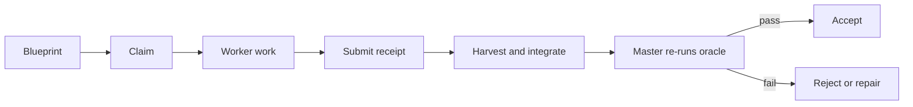

# Getting Started

[中文](getting-started.zh-CN.md)

This page gives a short path from installation to a first skill call.

## What b3ehive Does

b3ehive is a set of five portable skills for agent work. Each skill uses a
different work arrangement. The skills share a core law, an attempt loop, and
evidence rules.

A skill is an agent instruction set. It is not a new `b3ehive` subcommand.
The current CLI provides `compete`, `doctor`, `sync`, `lint`, and `check`.

## Choose an Install Path

For Codex, install the plugin:

```bash
codex plugin marketplace add weiyangzen/b3ehive
codex plugin add b3ehive@b3ehive
```

Start a new Codex thread after installation.

For portable skills, install the five skill directories:

```bash
git clone -b v2 https://github.com/weiyangzen/b3ehive.git
cd b3ehive
scripts/install_skills.sh --target all --scope user --link
```

Use `--target` to select platforms. Use `--scope project` for a project-local
installation. Use `--link` when the checkout should remain the source of the
installed files.

Check an installation against this checkout:

```bash
bin/b3ehive doctor --repo .
```

## Choose a Skill

Start with [Skill Selection and Use](skill-selection.md). The short map is:

| Task | Skill |
|---|---|
| Compare proposals or find a root cause | `compete-cron-builder` |
| Execute a long implementation | `execution-cron-builder` |
| Understand, transform, or translate a source scope | `learn-cron-builder` |
| Improve a measured result or a design | `optimization-cron-builder` |
| Set external loop granularity or shared governance | `looper-cron-builder` |

## Make a First Call

Mention the skill by name and give it a goal, a scope, and an acceptance
condition. For example:

```text
Use execution-cron-builder for this repository.

Goal: add avatar upload support without breaking profile updates.
Constraints: preserve authentication, do not publish, and do not change files
outside the declared work items.
First inspect the repository instructions, dirty state, tests, and build entry
points. Then propose a frozen blueprint. Each item must have dependencies,
owned paths, and an oracle. Do not start workers until the blueprint is valid.
```

For a small task, use the normal agent workflow. `execution-cron-builder` adds
value when the work has multiple dependencies, isolated workers, a long
lifecycle, or recovery needs.

## One Execution Lifecycle



The blueprint is the source of requirements and state. A worker implements and
submits. The master integrates and accepts. An oracle measures or judges the
result. A receipt records the evidence. A submitted item is not accepted until
the master re-runs its oracle.

## Use the CLI as a Supplement

Run a proposal competition from the shell:

```bash
bin/b3ehive compete --question-type precision \
  --oracle-command 'make check CANDIDATE={candidate_dir}' \
  --oracle-runs 3 \
  "Pick the root cause of the failing scheduler test"
```

Use `--mock` for a dry competition. Use these commands for repository
maintenance:

```bash
bin/b3ehive doctor --repo .
bin/b3ehive sync
bin/b3ehive lint
bin/b3ehive check
```

There is no `b3ehive execution` or `b3ehive learn` command. Those names refer
to skills that an agent loads and follows.

## First-Use Checklist

- Select one primary skill.
- State the goal and the in-scope files or source scope.
- Name the oracle or review protocol.
- State side-effect limits.
- Give a budget or a stop condition for long work.
- Start a new session after installing or updating a skill.
- Check the receipt and acceptance evidence before calling work complete.
