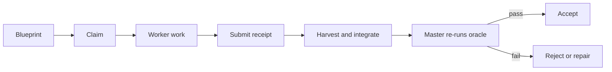

# 开始使用

[English](getting-started.md)

本页给出从安装到第一次调用 skill 的最短路径。

## b3ehive 做什么

b3ehive 是一组用于 agent 工作的五个 portable skill。每个 skill 使用一种
工作编排。五个 skill 共用 core law、attempt loop 和 evidence 规则。

skill 是给 agent 的 instruction set。它不是新的 `b3ehive` 子命令。
当前 CLI 提供 `compete`、`doctor`、`sync`、`lint` 和 `check`。

## 选择安装路径

如果使用 Codex，安装 plugin：

```bash
codex plugin marketplace add weiyangzen/b3ehive
codex plugin add b3ehive@b3ehive
```

安装后新开 Codex thread。

如果使用 portable skill，安装五个 skill 目录：

```bash
git clone -b v2 https://github.com/weiyangzen/b3ehive.git
cd b3ehive
scripts/install_skills.sh --target all --scope user --link
```

使用 `--target` 选择平台。使用 `--scope project` 安装到项目目录。使用
`--link` 让当前 checkout 保持为已安装文件的源。

检查安装是否与当前 checkout 一致：

```bash
bin/b3ehive doctor --repo .
```

## 选择 skill

先阅读 [Skill 选择与使用](skill-selection.zh-CN.md)。简表如下：

| 任务 | Skill |
|---|---|
| 比较方案或查找根因 | `compete-cron-builder` |
| 执行长期实现 | `execution-cron-builder` |
| 理解、转换或翻译 source scope | `learn-cron-builder` |
| 改进可测量结果或设计 | `optimization-cron-builder` |
| 定义外挂 loop 粒度或共享治理 | `looper-cron-builder` |

## 第一次调用

在请求中写出 skill 名称、目标、范围和验收条件。例如：

```text
Use execution-cron-builder for this repository.

Goal: add avatar upload support without breaking profile updates.
Constraints: preserve authentication, do not publish, and do not change files
outside the declared work items.
First inspect the repository instructions, dirty state, tests, and build entry
points. Then propose a frozen blueprint. Each item must have dependencies,
owned paths, and an oracle. Do not start workers until the blueprint is valid.
```

小任务直接使用普通 agent。任务包含多个依赖、隔离 worker、长期运行或恢
复需求时，`execution-cron-builder` 才有明显价值。

## 一次 execution 的生命周期



blueprint 是需求和状态的 source。worker 负责实现和提交。master 负责集成
和验收。oracle 负责测量或判定。receipt 记录 evidence。工作项提交后，只有
master 重新运行 oracle，才能被接受。

## CLI 作为补充

从 shell 启动一次 proposal competition：

```bash
bin/b3ehive compete --question-type precision \
  --oracle-command 'make check CANDIDATE={candidate_dir}' \
  --oracle-runs 3 \
  "Pick the root cause of the failing scheduler test"
```

使用 `--mock` 做 dry competition。使用以下命令维护仓库：

```bash
bin/b3ehive doctor --repo .
bin/b3ehive sync
bin/b3ehive lint
bin/b3ehive check
```

不存在 `b3ehive execution` 或 `b3ehive learn` 命令。这些名称指的是 agent
加载并遵循的 skill。

## 第一次使用检查表

- 选择一个主要 skill。
- 写出目标和文件范围或 source scope。
- 指定 oracle 或 review protocol。
- 写出副作用限制。
- 为长期工作写出预算或停止条件。
- 安装或更新 skill 后新开 session。
- 在宣布完成前检查 receipt 和验收证据。
