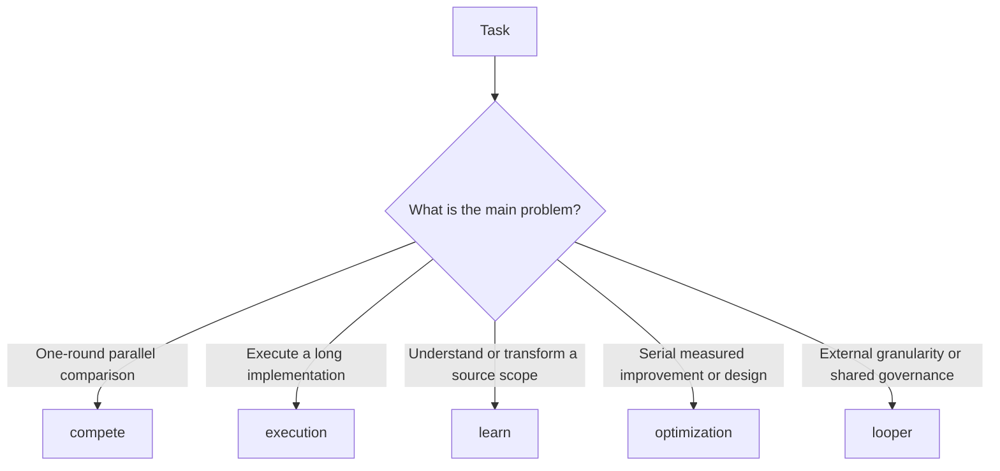

# Skill Selection and Use

[中文](skill-selection.zh-CN.md)

Choose a skill by the problem you need to solve. The five skills are not five
required stages. Use one skill when it is enough. Combine skills when the work
needs more than one arrangement.



The diagram is a quick choice aid. Read the sections below for the input,
output, and acceptance rule for each skill.

## `compete-cron-builder`

`compete` runs a single bounded comparison round. It evaluates parallel
candidates against one frozen question and selects or unions the results.

### Use it when

- several proposals can solve the same problem;
- you need a root-cause search;
- you need an audit or coverage sweep;
- you need to select a blueprint or execution plan.

### Do not use it when

- the correct implementation is already clear;
- the task needs one long implementation rather than a choice;
- there is no oracle or review protocol.

### Minimum input

- a frozen question;
- a question type such as `precision`, `coverage`, `audit`, `repair`,
  `blueprint`, or `execution_choice`;
- the candidate count and selected count;
- an oracle command or review protocol;
- an agent runner.

### Main output

The run produces candidates, receipts, measurements, selection evidence, and
either selected proposals or deduplicated findings.

### Prompt

```text
Use compete-cron-builder.
Question: find the root cause of the failing scheduler test.
Question type: precision.
Oracle: make check CANDIDATE={candidate_dir}.
Run the oracle three times and select one repair.
Do not count a candidate's own vote.
```

### Acceptance

The oracle runs first. A blind review and votes can follow. A candidate report
without a reproduction is not a valid audit finding.

### Common misuse

Do not use candidate id order as the selection rule. Do not call a collection of
unverified opinions a coverage result.

## `execution-cron-builder`

### Use it when

- the task has several dependent implementation items;
- workers need isolated workspaces;
- the run needs claims, receipts, checkpoints, or repair generations;
- the task must continue for a long time.

### Do not use it when

- one agent can safely complete a small change;
- the goal or acceptance rule is not clear;
- the task has no stable specification.

### Minimum input

- a goal and a repository scope;
- a blueprint path and item grammar;
- dependencies and owned paths;
- an oracle for every item;
- a platform, substrate, lifecycle, budget, and stop condition.

### Main output

The run produces an authoritative blueprint, isolated claims, worker
submissions, receipts, integration records, acceptance evidence, and a read-only
status projection.

### Prompt

```text
Use execution-cron-builder for this repository.
First inspect the repository instructions and dirty state.
Create a frozen blueprint for the implementation.
Every item must declare depends_on, owned_paths, oracle, tier, and budget.
Use a bounded lifecycle. Workers may submit; only the master may accept.
Re-run each oracle after integration.
```

### Acceptance

The master integrates a submission, re-runs the item's oracle at the required
tier, and records the evidence before it changes the item to `[x]`.

### Common misuse

Do not start workers before the specification is frozen. Do not let workers edit
the canonical blueprint or accept their own submissions.

## `learn-cron-builder`

### Use it when

- the source scope is unfamiliar;
- code or schema must be transformed;
- documents must be translated with structural parity;
- outside documents must become a pinned canon.

### Do not use it when

- the source scope is already understood;
- a short answer is enough;
- the task needs open-ended research without a locked scope.

### Minimum input

- a frozen source scope;
- a `source_manifest.tsv`;
- a target contract;
- a route decision;
- a traceability rule.

### Main output

The output can be one-to-one learning notes, transformed files, translated
documents, or a canon manifest with excerpts and hashes.

### Prompt

```text
Use learn-cron-builder in understand mode.
Lock the source scope to src/ and preserve its file and folder shape.
Create a source manifest before writing notes.
Every note must trace to a source row.
Leave source files unchanged.
```

### Acceptance

The manifest covers the scope exactly. Each output traces to a source row.
Translation preserves headings, anchors, links, code blocks, tables, and
glossary decisions.

### Common misuse

Do not replace a locked manifest with a list of files chosen after reading. Do
not treat a broad summary as proof of one-to-one coverage.

## `optimization-cron-builder`

`optimization` normally compares candidates in series. It keeps a baseline,
measures one candidate, keeps or reverts it, and uses the result to choose the
next candidate. Parallel `lanes` are an exception for one comparison round.

### Use it when

- the target is faster, smaller, cheaper, or more reliable;
- a benchmark can measure the target;
- a design must be refined against a stated philosophy.

### Do not use it when

- no objective or oracle exists;
- the task is only to choose between proposals;
- a single correctness fix has no optimization target.

### Minimum input

For measured mode, provide an oracle contract, workload, baseline, tolerance,
measurement method, instrument, and budget. For design mode, provide a design
philosophy and a stage blueprint.

### Main output

Measured mode produces before and after measurements, a hypothesis ledger, and
accepted changes. Design mode produces an authoritative AR blueprint and one
research document per accepted item.

### Prompt

```text
Use optimization-cron-builder in measured mode.
Target: reduce API p95 latency below 200 ms.
Oracle: ./scripts/benchmark.sh.
Record the baseline, workload, measurement method, and anti-gaming checks.
Re-run the full oracle on fresh inputs after each candidate.
```

### Acceptance

The baseline reproduces. An accepted change has fresh before and after
evidence. A reported speedup without raw evidence counts for nothing.

### Common misuse

Do not call one faster local run an optimization result. Do not change the
benchmark after seeing a candidate result.

## `looper-cron-builder`

`looper` is an optional external layer. It defines the granularity and
attachment of a loop to an item, metric, or surface. The selected skill usually
handles its smallest work unit internally. Use `looper` when the loop itself
needs an explicit budget, side-effect policy, shared resource envelope, or
different attachment granularity.

### Use it when

- a loop must attach to an item, metric, or surface at an explicit granularity;
- a target needs repeated attempts;
- several loops share a budget;
- attempts need leases, side-effect gates, ROI, or pause rules;
- a long-running process needs controlled recovery.

### Do not use it when

- one bounded attempt is enough;
- the selected skill already handles the smallest work unit;
- there is no budget or stop condition;
- the task is a simple implementation or review.

### Minimum input

- a target and an oracle or monitoring source;
- a budget envelope;
- a lease policy;
- an attempt shape;
- side-effect rules;
- pause and resume conditions.

### Main output

The run produces loop specifications, leases, attempts, evidence rows, side
effect decisions, and governance decisions such as `continue`, `pause`,
`split`, `escalate`, or `retire`.

### Prompt

```text
Use looper-cron-builder to govern this benchmark improvement loop.
Each attempt needs a lease for time and tokens.
Pause after three stalled attempts.
Do not repeat the same strategy without new evidence.
Gate network, publish, delete, and protected-path side effects.
```

### Acceptance

Every attempt has a lease and evidence. Pending operator signals are handled
before new leases. A paused loop does not resume without new budget and a
changed strategy.

### Common misuse

Do not use a loop to hide an unclear goal. Do not run the same failed strategy
until the budget is gone.

## Combining Skills

Use the smallest combination that matches the work:

```text
learn → execution
compete → execution
optimization → execution
looper → add external granularity or governance to a compete, execution, or optimization run
```

The combination is a workflow choice. It is not a requirement to load all five
skills.
