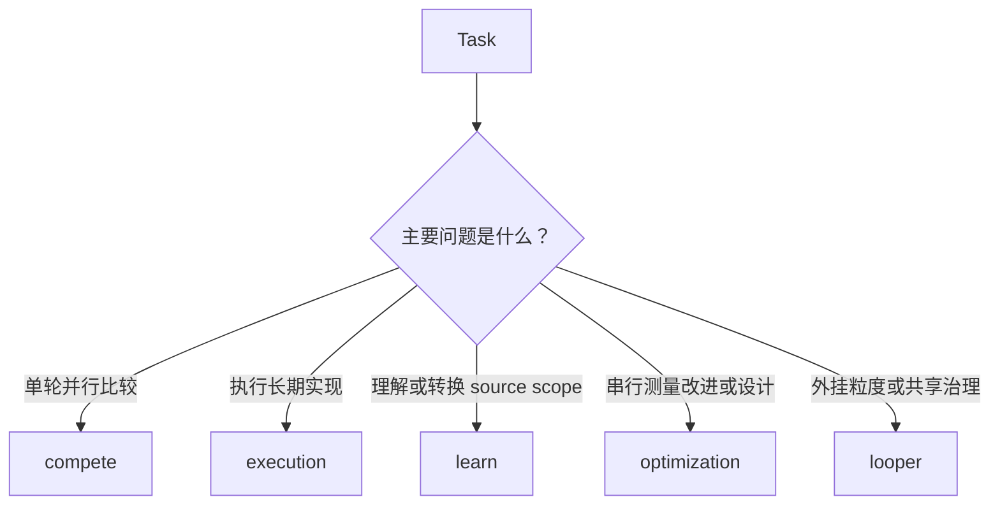

# Skill 选择与使用

[English](skill-selection.md)

按要解决的问题选择 skill。五个 skill 不是五个必经阶段。一个 skill 足够
时只使用一个；任务需要多种编排时再组合。



这张图只用于快速选择。每个 skill 的输入、输出和验收规则见下文。

## `compete-cron-builder`

`compete` 执行一次有边界的比较轮。它让多个 candidate 并行回答同一个冻结
问题，再选择结果或合并 findings。

### 适用场景

- 多个方案可以解决同一个问题；
- 需要查找根因；
- 需要做审计或覆盖检查；
- 需要选择 blueprint 或 execution plan。

### 不适用场景

- 正确实现已经清楚；
- 任务需要长期实现，而不是做选择；
- 没有 oracle 或 review protocol。

### 最小输入

- 冻结的问题；
- `precision`、`coverage`、`audit`、`repair`、`blueprint` 或
  `execution_choice` 等 question type；
- 候选数量和选择数量；
- oracle command 或 review protocol；
- agent runner。

### 主要输出

run 会产生 candidates、receipts、measurements、selection evidence，以及
选中的 proposal 或去重后的 findings。

### Prompt

```text
Use compete-cron-builder.
Question: find the root cause of the failing scheduler test.
Question type: precision.
Oracle: make check CANDIDATE={candidate_dir}.
Run the oracle three times and select one repair.
Do not count a candidate's own vote.
```

### 验收

先运行 oracle，再进行 blind review 和投票。没有 reproduction 的 audit
finding 无效。

### 常见误用

不要按 candidate id 顺序选择。不要把未经验证的意见集合称为 coverage
结果。

## `execution-cron-builder`

### 适用场景

- 任务有多个相互依赖的实现项；
- worker 需要隔离 workspace；
- run 需要 claim、receipt、checkpoint 或 repair generation；
- 任务需要长期运行。

### 不适用场景

- 一个 agent 可以安全完成的小修改；
- 目标或验收规则不清楚；
- 任务没有稳定的 specification。

### 最小输入

- 目标和 repository scope；
- blueprint path 和 item grammar；
- dependencies 和 owned paths；
- 每个 item 的 oracle；
- platform、substrate、lifecycle、budget 和 stop condition。

### 主要输出

run 会产生 authoritative blueprint、隔离的 claims、worker submissions、
receipts、integration records、acceptance evidence 和只读状态投影。

### Prompt

```text
Use execution-cron-builder for this repository.
First inspect the repository instructions and dirty state.
Create a frozen blueprint for the implementation.
Every item must declare depends_on, owned_paths, oracle, tier, and budget.
Use a bounded lifecycle. Workers may submit; only the master may accept.
Re-run each oracle after integration.
```

### 验收

master 集成 submission，在要求的 tier 上重新运行 item 的 oracle，并记录
evidence 后，才能把 item 改为 `[x]`。

### 常见误用

不要在 specification 冻结前启动 worker。不要让 worker 修改 canonical
blueprint，也不要让 worker 验收自己的 submission。

## `learn-cron-builder`

### 适用场景

- source scope 陌生；
- 需要转换代码或 schema；
- 需要保持结构对应地翻译文档；
- 需要把外部文档变成 pinned canon。

### 不适用场景

- source scope 已经理解；
- 一个短回答已经足够；
- 任务需要开放式研究，但没有 locked scope。

### 最小输入

- frozen source scope；
- `source_manifest.tsv`；
- target contract；
- route decision；
- traceability 规则。

### 主要输出

输出可以是一对一学习笔记、转换后的文件、翻译文档，或带 excerpts 和
hashes 的 canon manifest。

### Prompt

```text
Use learn-cron-builder in understand mode.
Lock the source scope to src/ and preserve its file and folder shape.
Create a source manifest before writing notes.
Every note must trace to a source row.
Leave source files unchanged.
```

### 验收

manifest 必须精确覆盖 scope。每个输出都必须追溯到 source row。翻译必须
保留 headings、anchors、links、code blocks、tables 和 glossary decisions。

### 常见误用

不要用读完后才选择的文件列表替换 locked manifest。不要把 broad summary
当作一对一覆盖的证明。

## `optimization-cron-builder`

`optimization` 通常串行比较 candidate。它保留 baseline，测量一个 candidate，
决定保留或回退，再用结果选择下一个 candidate。只有独立 hypothesis 需要同一
轮比较时，才使用并行 `lanes`。

### 适用场景

- 目标是更快、更小、更省或更可靠；
- 有 benchmark 可以测量目标；
- 需要按照明确的 design philosophy 改进设计。

### 不适用场景

- 没有 objective 或 oracle；
- 任务只是比较方案；
- 单个 correctness fix 没有 optimization target。

### 最小输入

Measured mode 需要 oracle contract、workload、baseline、tolerance、测量方
法、instrument 和 budget。Design mode 需要 design philosophy 和 stage
blueprint。

### 主要输出

Measured mode 产生 before/after measurements、hypothesis ledger 和被接受的
修改。Design mode 产生 authoritative AR blueprint 和每个 accepted item 的
research document。

### Prompt

```text
Use optimization-cron-builder in measured mode.
Target: reduce API p95 latency below 200 ms.
Oracle: ./scripts/benchmark.sh.
Record the baseline, workload, measurement method, and anti-gaming checks.
Re-run the full oracle on fresh inputs after each candidate.
```

### 验收

baseline 必须可复现。每个 accepted change 都必须有 fresh before/after
evidence。只有 agent 报告的 speedup 不算证据。

### 常见误用

不要把一次更快的本地运行称为优化结果。不要在看到 candidate 结果后修改
benchmark。

## `looper-cron-builder`

`looper` 是可选的外挂层。它把 loop 挂到 item、metric 或 surface，并定义 loop
的粒度。选中的 skill 通常已经内化最小工作单元，不需要为每个最小动作单独定义
一个 looper。只有 loop 需要明确的 budget、side-effect policy、共享资源边界，
或需要挂在不同粒度上时，才使用 `looper`。

### 适用场景

- loop 需要在明确粒度上挂到 item、metric 或 surface；
- 目标需要重复尝试；
- 多个 loop 共享预算；
- 尝试需要 lease、side-effect gate、ROI 或 pause 规则；
- 长期运行的进程需要受控恢复。

### 不适用场景

- 一次 bounded attempt 已经足够；
- 选中的 skill 已经处理最小工作单元；
- 没有预算或 stop condition；
- 任务只是简单实现或审查。

### 最小输入

- target 和 oracle 或 monitoring source；
- budget envelope；
- lease policy；
- attempt shape；
- side-effect 规则；
- pause 和 resume 条件。

### 主要输出

run 会产生 loop specifications、leases、attempts、evidence rows、side
effect decisions，以及 `continue`、`pause`、`split`、`escalate` 或 `retire`
等治理决策。

### Prompt

```text
Use looper-cron-builder to govern this benchmark improvement loop.
Each attempt needs a lease for time and tokens.
Pause after three stalled attempts.
Do not repeat the same strategy without new evidence.
Gate network, publish, delete, and protected-path side effects.
```

### 验收

每个 attempt 都有 lease 和 evidence。新 lease 前先处理 pending operator
signals。暂停的 loop 必须有新 budget 和新 strategy 才能恢复。

### 常见误用

不要用 loop 隐藏不清楚的目标。不要重复运行同一个失败 strategy，直到预算
耗尽。

## 组合 skill

使用与任务匹配的最小组合：

```text
learn → execution
compete → execution
optimization → execution
looper → 为 compete、execution 或 optimization run 增加外挂粒度或治理
```

组合是 workflow 选择，不要求每次都加载五个 skill。
