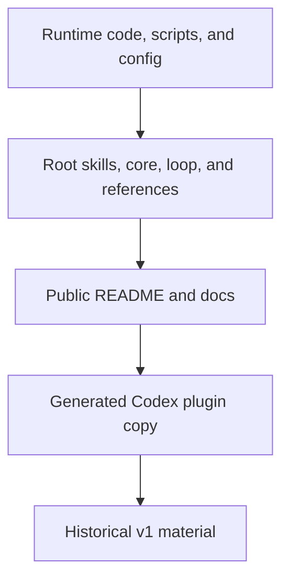

# Writing Style

[中文](writing-style.zh-CN.md)

This page defines the writing rules for b3ehive documentation and user-visible
technical output.

## ASD-STE100 Scope

b3ehive uses ASD-STE100 Issue 9 as the reference for English technical writing.
The standard has writing rules and a controlled dictionary. Use the official
sources for the current rules and vocabulary:

- [ASD-STE100 FAQ](https://www.asd-ste100.org/STE_faq.html)
- [Issue 9, January 2025](https://www.asd-ste100.org/assets/files/ASD-STE100_ISSUE9.pdf)
- [Official downloads](https://www.asd-ste100.org/STE_downloads.html)

This page applies the standard to b3ehive content. It does not reproduce the
standard or its full dictionary. It does not claim formal ASD-STE100
certification.

## English Rules

- Use one sentence for one main action or fact.
- Use a clear subject and an active verb.
- Use a short sentence when a shorter sentence is clear.
- Use one technical term for one concept.
- Use approved general words with their approved meaning and part of speech.
- Use short, stable technical nouns for project concepts.
- Use American English spelling unless a repository or customer rule says
  otherwise.
- Explain an uncommon term at first use.
- State a condition before the action that depends on it.
- Use numbered steps for a procedure.
- Use a table when the text maps several items to several results.

Avoid:

- idioms and metaphors;
- vague words such as `easy`, `quick`, or `soon` without a measure;
- unnecessary synonyms for the same concept;
- noun chains that hide the action;
- claims of success without evidence;
- a passive sentence when the actor matters.

Examples:

| Avoid | Use |
|---|---|
| The worker is responsible for the acceptance of the patch. | The master accepts the patch. |
| Make sure that the oracle is run again. | Re-run the oracle after integration. |
| This provides a very powerful way to improve quality. | This records the evidence for the quality check. |
| The process can be restarted in the event of a failure. | Restart the process after a failure. |

These examples are project guidance. A full vocabulary decision must use the
official dictionary.

## Chinese Rules

ASD-STE100 is an English controlled language. Chinese pages do not claim formal
STE compliance. Apply the same clarity goals:

- 一句话只表达一个主要动作或事实；
- 明确主语和动作；
- 优先使用主动表达；
- 一个概念固定使用一个术语；
- 首次出现的术语给出短定义；
- 使用可验证的数量、条件和结果；
- 不使用无法验证的宣传词；
- 步骤使用编号列表；
- 对应关系使用表格。

## Canonical Terms

Keep these names stable:

| Term | Meaning in b3ehive |
|---|---|
| `blueprint` | The authority for requirements, state, and dependencies in a run. |
| `worker` | An agent that claims and submits an item. |
| `master` | The role that integrates submissions and accepts or rejects them. |
| `oracle` | A command or review protocol that measures or judges an item. |
| `receipt` | Evidence for a worker submission. |
| `canon` | A pinned set of outside facts and source metadata. |
| `lease` | A bounded grant of resources for an attempt. |
| `claim` | A worker's ownership of an item during a run. |
| `submit` | The act of sending a result and its receipt for review. |
| `accept` | The master's decision after integration and re-validation. |

Do not replace these terms with casual synonyms. Define a term at first use and
use the same spelling after that.

## Code and Product Names

Do not rewrite these surfaces for style:

- commands and flags;
- file and directory paths;
- API names and schema fields;
- code identifiers;
- product names and platform names;
- quoted output from a tool;
- a source citation or a required external term.

Explain the surface in surrounding text when it is not clear. Do not change the
surface itself.

## Source of Truth

The writing process follows this order:

This diagram shows authority, not an editing order. Runtime and root sources
define behavior. Public docs explain that behavior. Plugin copies are generated.
Historical material explains migration or compatibility.

## Review Checklist

### Content

- The page states its audience and purpose.
- Each technical claim has a source or a local code reference.
- Current behavior is separate from historical behavior.
- Commands match the current CLI help.
- Examples state their inputs and acceptance conditions.

### Structure

- The English and Chinese pages have matching sections.
- The page has a language link at the top.
- Internal links resolve to the current file names.
- Mermaid diagrams have a text explanation.
- A table is used when a mapping is clearer than prose.

### Language

- English follows the Issue 9 rules and vocabulary where they apply.
- Chinese follows the equivalent controlled-writing rules.
- Canonical terms do not drift.
- The page does not claim formal STE certification.
- The page does not claim a test, measurement, or review that did not run.

## Maintenance

Edit root skill sources first. Sync shared files and the Codex plugin after a
root change. Review the generated diff. Update the paired language page in the
same change.
