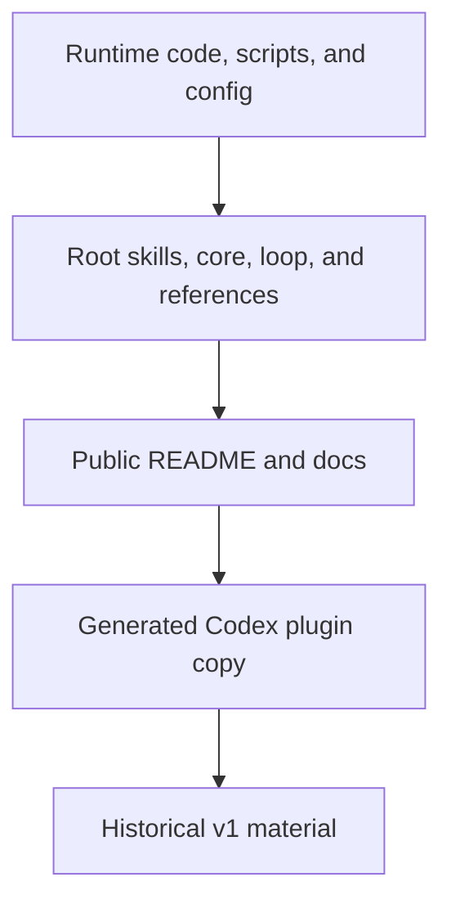

# 写作规范

[English](writing-style.md)

本页定义 b3ehive 文档和用户可见技术输出的写作规则。

## ASD-STE100 适用范围

b3ehive 使用 ASD-STE100 Issue 9 作为英文技术写作的参考。该标准包含写作规
则和受控词典。当前规则和词汇应以官方来源为准：

- [ASD-STE100 官方 FAQ](https://www.asd-ste100.org/STE_faq.html)
- [Issue 9，2025 年 1 月](https://www.asd-ste100.org/assets/files/ASD-STE100_ISSUE9.pdf)
- [官方下载页](https://www.asd-ste100.org/STE_downloads.html)

本页把标准应用到 b3ehive 内容，不复制标准全文或完整词典，也不声称获得正
式 ASD-STE100 认证。

## 英文规则

- 一句话只表达一个主要动作或事实。
- 使用明确的主语和主动动词。
- 句子较短且含义清楚时，使用较短句子。
- 一个技术术语只表示一个概念。
- 使用受控词典允许的普通词，并保持规定的含义和词性。
- 为项目概念使用短而稳定的技术名词。
- 除非仓库或客户有其他要求，使用 American English spelling。
- 首次出现的不常见术语给出说明。
- 先写条件，再写依赖该条件的动作。
- 操作步骤使用编号列表。
- 多个对象和结果需要对应时使用表格。

避免：

- 习语和隐喻；
- 没有度量的 `easy`、`quick` 或 `soon` 等模糊词；
- 为同一概念反复使用不同同义词；
- 隐藏动作的名词堆叠；
- 没有 evidence 的成功声明；
- 行为主体重要时使用被动句。

示例：

| 避免 | 使用 |
|---|---|
| The worker is responsible for the acceptance of the patch. | The master accepts the patch. |
| Make sure that the oracle is run again. | Re-run the oracle after integration. |
| This provides a very powerful way to improve quality. | This records the evidence for the quality check. |
| The process can be restarted in the event of a failure. | Restart the process after a failure. |

这些示例是项目指南。完整的词汇判断必须使用官方词典。

## 中文规则

ASD-STE100 是英文受控语言。中文页面不宣称正式 STE 合规，但使用相同的清
晰性目标：

- 一句话只表达一个主要动作或事实；
- 明确主语和动作；
- 优先使用主动表达；
- 一个概念固定使用一个术语；
- 首次出现的术语给出短定义；
- 使用可验证的数量、条件和结果；
- 不使用无法验证的宣传词；
- 步骤使用编号列表；
- 对应关系使用表格。

## Canonical Terms

保持以下名称稳定：

| Term | b3ehive 中的含义 |
|---|---|
| `blueprint` | 一次 run 中需求、状态和依赖关系的权威来源。 |
| `worker` | claim 并提交 item 的 agent。 |
| `master` | 集成 submission 并接受或拒绝结果的角色。 |
| `oracle` | 测量或判定 item 的 command 或 review protocol。 |
| `receipt` | worker submission 的 evidence。 |
| `canon` | 固定外部事实和 source metadata 的集合。 |
| `lease` | 一次 attempt 获得的有边界资源授权。 |
| `claim` | worker 在一次 run 中取得的 item 所有权。 |
| `submit` | 提交结果和 receipt 以供审查。 |
| `accept` | master 集成并重新验证后的决定。 |

不要用随意的同义词替换这些术语。首次出现时定义，后续保持相同拼写。

## 代码和产品名称

不要为了语言风格改写以下内容：

- command 和 flag；
- 文件和目录路径；
- API 名称和 schema field；
- code identifier；
- 产品名和平台名；
- tool 的引用输出；
- source citation 或外部要求的固定术语。

如果内容不清楚，在周围文字中解释，不要修改名称本身。

## Source of Truth

写作过程遵循以下顺序：

这张图表示 authority，不表示编辑顺序。runtime 和 root source 定义行为。
公开文档解释行为。plugin copy 由 source 生成。历史资料解释迁移或兼容面。

## 审查清单

### 内容

- 页面写明读者和目的。
- 每个技术结论都有 source 或本地代码引用。
- 当前行为和历史行为分开。
- command 与当前 CLI help 一致。
- 示例写明输入和验收条件。

### 结构

- 中英文页面的章节对应。
- 页面顶部有语言链接。
- 内部链接指向当前文件名。
- Mermaid 图有文字说明。
- 映射关系使用表格表达。

### 语言

- 英文在适用范围内遵循 Issue 9 规则和词汇。
- 中文遵循等价的受控写作规则。
- canonical term 不漂移。
- 页面不声称正式 STE 认证。
- 页面不声称未运行的测试、测量或审查已经完成。

## 维护

先修改 root skill source。root 文件变化后同步 shared files 和 Codex plugin。
检查生成 diff。双语页面必须在同一次修改中更新。
